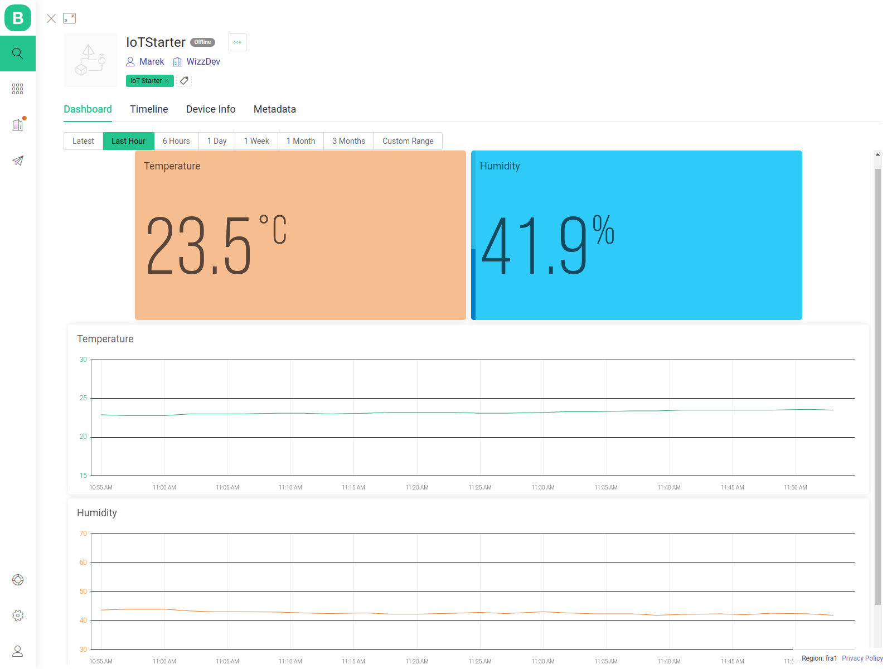

# Set up account and device on Blynk cloud platform
The instruction walks you through the process of creating your own IoT device in just a few steps.

An example web dashboard that might be created can look like this:


## What is Blynk
[Blynk](https://blynk.io/) is a cloud service provider allowing for building and managing connected hardware: device provisioning, sensor data visualization, remote control with mobile and web applications, over-the-air firmware updates and much more.

## Installation

### 1. Create virtual environment:
First, you need to create virtual environment (either with python venv module or anaconda-python):

Note, that **"ENV_NAME"** is the name of the environment you’re creating.

Enter main directory of the project (iot-starter):
```bash
cd iot-starter
```

* For anaconda (either in terminal - Linux or anaconda prompt - Windows):
  ```
  conda create --name ENV_NAME python=3.7 pip
  ```

* For venv:
  * Linux:
  ```
  python3 -m venv ENV_NAME
  ```

  * Windows:
  ```
  python -m venv ENV_NAME
  ```

Next, you should activate it. This step is platform dependent:
#### Windows
* For anaconda:
  ```
  conda activate ENV_NAME
  ```

* For venv:
  ```
  ENV_NAME/Scripts/activate.bat
  ```

#### Linux/ Mac OS
* For anaconda:
  ```
  conda activate ENV_NAME
  ```

* For venv:
  ```
  source ENV_NAME/bin/activate
  ```

### 2. Install requirements

After you've created virtual environment, your current directory should be "iot-starter"

``` 
pip install pyserial cryptography click future pyelftools setuptools
pip install -r Blynk/requirements.txt
```

## Set up Blynk account

### 1. Create account

First, you need to create an account on Blynk cloud website: [blynk.cloud](https://blynk.cloud/dashboard/register). Follow standard registration procedure providing your email and then activating the account.

### 2. Creating template and your device

After you first log in into your new account on Blynk,Console you'll be probably prompted with a quickstart device. Please close the window as we're going to do it manually.

#### **Template**:

Template will be used for creating your new IoT-Starter device.

 1. On the left side pane search for **"Templates"** option.
 2. Click on **"+ New Template"** with the name and description of your choice. Make sure to use hardware **"ESP32"** and connection type **"WiFi"**. After creating the template you can modify it further adding an image, metadata etc.
 3. Now you need to create two **"Datastreams"** that are responsible for accepting telemetry data (temperature and humidity) from our device. To do that go to:<br>
 **"Datastreams" --> "+ New Datastream" --> "Virtual Pin"<br>**
 Please make two virtual pin datastreams for temperature and humidity. **Please note** which pin is responsible for each telemetry type (only number matters, so if you're assigning **V0** to temperature, the pin responsible for the temperature telemetry is no. **0**). Make sure that the **"Data Type"** is set to **"Double"**. You can also add **"Units"** to the pins (Celsius for the temperature and percentage for the humidity) - it is optional though. Please also adjust the **min** and **max** value for each pin (0 - 100 for the humidity and for example 10 - 40 for the temperature) as well as check the **"Thousands seperator"** option.
 4. After creating both virtual pins you can set up a web dashboard after clicking **"Web dashboard"** option. (**"Mobile dashboard"** can be only created in **"Blynk IoT"** mobile app.)
 5. Save the changes made to the template.

#### **Device**:

Device will be created from already created template, so all you need to do is:

 1. Click on the left side pane **"Search"** --> **"+ New Device"** --> **"From template"**
 2. Select your template and give some meaningful name to your device.
 3. Click on the created device and go to **"Device info"** and on the right side look for **"BLYNK_AUTH_TOKEN"**. It should look like this:<br>
 ```
 #define BLYNK_AUTH_TOKEN "<long_sequence_of_random_characters>";
 ```
 Copy this long sequence as you will need it in a moment.

After all steps above you should have saved three things:
 - Virtual pin for temperature
 - Virtual pin for humidity
 - Device auth token
