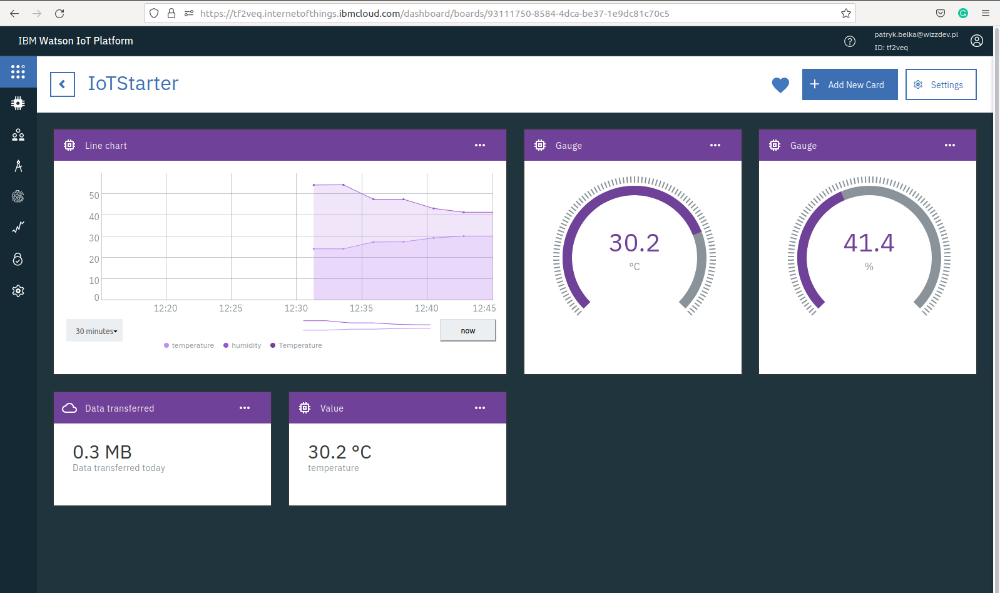

# Set up account and device on IBM Watson IoT platform
The instruction walks you through the process of creating your own IoT device in just a few steps.

An example dashboard that might be created can look like this:


## What is IBM Watson IoT Platform
[IBM Watson IoT Platform](https://internetofthings.ibmcloud.com/) is a clean and simple UI where you can simply and easily add and manage your devices, control access to your IoT service, and monitor your usage. It's free of charge with a limit of up to 500 devices and 200MB of data transfer.

## Installation

### Install requirements

After you've created virtual environment, your current directory should be "iot-starter"

``` 
pip install -r IBM/requirements.txt
```

## Set up IBM Watson account

If you are stuck or something will be unclear in next few steps, we recommend looking at official IBM documentation about Getting Started at this [link](https://cloud.ibm.com/docs/IoT/devices/mqtt.html#).

### 1. Create account

First, you need to create an account on IBM Watson IoT Platform website: [ibm.com](https://internetofthings.ibmcloud.com/).


### 2. Create your first application and device endpoint

Create an IoT Platform Service Lite instance directly from the [Platform Service Page in the IBM Cloud Service Catalog](https://cloud.ibm.com/catalog/services/internet-of-things-platform).  
On the service page, click Launch to start administering your IBM Watson IoT Platform organization.
The IBM Watson IoT Platform web console opens in a new browser tab at the following URL:
https://<org_id>.internetofthings.ibmcloud.com/dashboard/#/overview Where org_id is the ID of your IBM Watson IoT Platform organization.

### 3. Create a device

1. In your IBM Watson IoT Platform dashboard, hover over the left side panel, and choose "Devices".
2. Click "Add Device" in the top right corner.
3. Create a device type. The device type name can be up to 36 characters long and contain only: Alpha-numeric characters, Hyphens(-), Underscores(_) and Periods(.). For example (IoTStarter)
4. Enter a device ID and click "Next".
5. Optional: Enter device type attributes and metadata and click "Next". (You can add and edit it later)
6. Enter an Authentication Token or click "Next" to auto-generate a Token.
7. Verify your information about the device and select "Finish" to add the device
8. IMPORTANT: Save your device credentials, as you will need them to connect a device. The Authentication token is non-recoverable.

After all steps above, you should have five things:
 - Organization ID
 - Device Type
 - Device ID
 - Authentication Method: "use-token-auth" by default
 - Authentication Token

