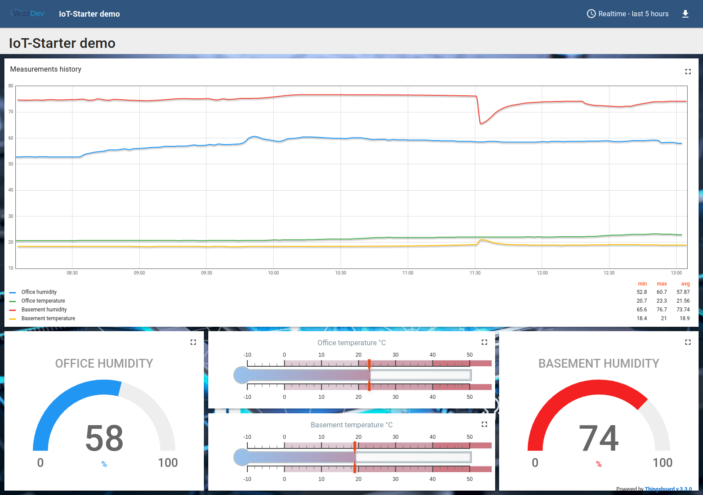

# Set up ThingsBoard locally on your computer
The instruction walks you through the process of creating your own IoT device in just a few steps.

An example dashboard that might be created can look like this:


## What is ThingsBoard
[ThingsBoard](https://thingsboard.io/) is an open-source IoT platform that enables rapid development, management, and scaling of IoT projects. You can host it locally on your device or use the paid cloud version.

## Installation

### Install requirements

After you've created virtual environment, your current directory should be "iot-starter"

``` 
pip install -r ThingsBoard/requirements.txt
```

## Set up local ThingsBoard server

### 1. Installation

## Linux
To create your own ThingsBoard server on Linux (Ubuntu), just follow this [instruction](https://thingsboard.io/docs/user-guide/install/ubuntu/).

## Windows
For Windows users, instruction can be found [here](https://thingsboard.io/docs/user-guide/install/windows/).

**NOTE**

During installation of Java 11 you may encounter a problem with finding an installation path. If you are unsure of where the java was installed, please run in the cmd following command:
```
echo %JAVA_HOME%
```
It will print you the java home path where you need to copy downloaded PostgreSQL JDBC Driver.

### 2. Device profile set up

Once you finally have your ThingsBoard ready, open your browser and navigate to server webpage. Default link for ThingsBoard installed on local machine is:
```
http://localhost:8080/
```
In case you set up cloud on some other device in your local network, please remember to adjust the address. For example, if the computer you installed ThingsBoard on has ip address: 192.168.1.21, then your link for accessing the web page would be:
```
http://192.168.1.21:8080/
```
Now go ahead and log in to your server. If you have specified *-loadDemo* during execution of the installation script, the default credentials are:
* System Administrator: sysadmin@thingsboard.org / sysadmin
* Tenant Administrator: tenant@thingsboard.org / tenant
* Customer User: customer@thingsboard.org / customer

You can always change password for each account in the account profile page.<br>
Please log in to **Tenant Administration** account.

Now the only thing you need to do is to obtain two keys needed for device registering. To do this, click on the **Device profiles** tab on the left and hit the profile name you want to use (you can use the default or create a new one). Toggle on edit mode, then go to the **Device provisioning** tab and change the **Provision strategy** to 'Allow to create new devices'. After applying changes, two new fields should appear - **Provision device key** and **Provision device secret**. Please copy them and save for later.

### 3. Open ports

To send telemetry data directly from your DevBoard to local server on your computer, you need to open two communication ports.

* Linux:
```
sudo ufw allow 8080
sudo ufw allow 1883
```
* Windows

To open necessary ports on Windows, please refer to this [link](https://thingsboard.io/docs/user-guide/install/windows/#windows-firewall-settings).
